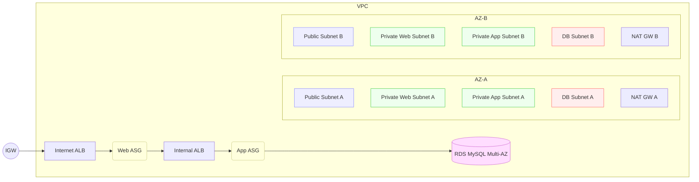

# AWS 3‑Tier HA (Anonymized) — Terraform

A production‑lean baseline for a **highly available 3‑tier web app** on AWS. Fully anonymized; no org or domain details required.

## What you get
- 1 VPC across **2 AZs**
- **Per‑AZ NAT Gateways** (no single point of failure for egress)
- Public subnets (web ALB) + private subnets (web/app ASGs) + isolated DB subnets
- **Internet‑facing ALB** (web) + **internal ALB** (app)
- **Auto Scaling Groups** with **SSM** access (no inbound SSH)
- **RDS MySQL (Multi‑AZ)** with security group restricted to the app tier
- **VPC Endpoints** for SSM/EC2 Messages and **S3 Gateway**
- Optional **ACM** for HTTPS on the web ALB
- Minimal **WAF ready** hook on the web ALB (disabled by default)
- Sensible tags, logging hooks, and variables

> **Note:** This is a teaching‑friendly, cost‑aware baseline. Multi‑AZ RDS and per‑AZ NAT incur charges. Review variables and scale shapes before applying.

## Diagram (Mermaid)


## Anonymization
- Uses neutral tags like `Project=three-tier-ha`.
- No hard‑coded domains, IP allowlists, or company names.
- Replace defaults via `terraform.tfvars` without changing code.

## Security posture
- **No inbound SSH** (use **AWS Systems Manager Session Manager**).
- Web SG allows **80/443 from 0.0.0.0/0** (lock down in production).
- App SG permits only from **web ALB SG** on the app port.
- DB SG permits only from **app ASG SG** on 3306.
- Private instances use **VPC Endpoints** for management without public egress.

## Cost controls
- Variable switches for Multi‑AZ RDS, access logs, and WAF association.
- Small defaults (t3 family) — tune for your workload.

## Modules
- `network/` VPC, subnets, routes, NAT, subnet groups
- `security/` security groups + IAM roles/profiles for SSM + secret access
- `compute/` launch templates & ASGs (web/app)
- `alb/` internet & internal ALBs, target groups, listeners
- `rds/` parameter group, subnet group, MySQL instance, optional proxy
- `endpoints/` interface endpoints (SSM/EC2Messages/SSMMessages) + S3 gateway

---

## Tear down
```bash
terraform destroy
```

## License
MIT
