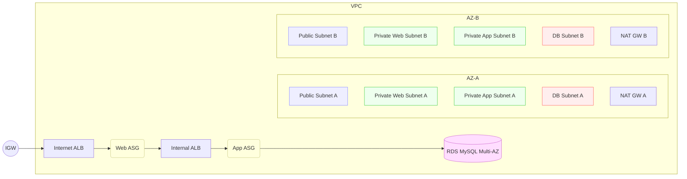

# AWS 3-Tier HA — Terraform

A production-lean baseline for a **highly available 3-tier web app** on AWS. The code is fully anonymized (no org, domain, or IP baked in) and designed for clarity + good defaults.

## What you get

- **1 VPC across 2 AZs**
- **Per-AZ NAT Gateways** (no single egress failure)
- Subnets:
  - Public (Internet ALB)
  - Private-Web (web ASG)
  - Private-App (app ASG + internal ALB)
  - DB (isolated, no default route to Internet)
- **Internet-facing ALB** (web tier) → **Internal ALB** (app tier)
- **Auto Scaling Groups** (web + app) with **SSM** access (no inbound SSH)
- **RDS MySQL (Multi-AZ)**; password stored in **Secrets Manager**
- **VPC Endpoints** (SSM/EC2Messages/SSMMessages + S3 Gateway)
- Optional **ACM** for HTTPS, **WAF** for web ALB, ALB **access logs**
- Sensible tagging, health checks, simple app bootstrap

> ⚠️ Costs: Multi-AZ RDS and per-AZ NAT are not free. Start in a sandbox account and review `terraform plan` before applying.

---

## Architecture



---

## Prerequisites

- **Terraform** 1.5+  
  - Windows: `winget install HashiCorp.Terraform`  
  - macOS: `brew tap hashicorp/tap && brew install hashicorp/tap/terraform`  
  - Linux: download from HashiCorp releases or use your package manager.
- **AWS CLI** (optional, but recommended)
  - Windows: `winget install Amazon.AWSCLI`
  - macOS: `brew install awscli`
- **AWS credentials** with rights to create VPC, subnets, routes, NAT, ALB, ASG, RDS, IAM role/instance profile, VPC endpoints, Secrets Manager.
  - Configure: `aws configure` (or set environment variables / SSO profile).

---

## Quick start (local)

### 1) Clone / unzip and enter the Terraform folder
**Windows PowerShell**
```powershell
cd "$HOME\Downloads\aws-3tier-ha-anon\terraform"
Get-ChildItem
```

**macOS/Linux**
```bash
cd ~/Downloads/aws-3tier-ha-anon/terraform
ls -la
```

You should see `main.tf`, `provider.tf`, `example.tfvars`, and `modules/`.

### 2) Create your variables file
**Windows**
```powershell
Copy-Item .\example.tfvars .\terraform.tfvars
notepad .\terraform.tfvars
```

**macOS/Linux**
```bash
cp example.tfvars terraform.tfvars
nano terraform.tfvars
```

Edit at minimum:
- `aws_region` (e.g., `"us-east-1"`)
- `vpc_cidr` (e.g., `"10.42.0.0/16"`)
- Optional toggles: `rds_multi_az`, `web_listener_https_enabled`, `alb_logs_s3_bucket`, `waf_web_acl_arn`.

### 3) Initialize, plan, apply
```bash
terraform init
terraform plan
terraform apply
```
Confirm `yes` when prompted.

**Outputs** will include:
- `public_alb_dns_name` → your web entrypoint  
- `app_alb_dns_name` → internal only (resolves inside VPC)  
- `rds_endpoint` → DB hostname

---

## What gets created (high level)

- **VPC & Subnets (2 AZs):**  
  - 2× Public (ALB), 2× Private-Web (web ASG), 2× Private-App (app ASG), 2× DB
- **Routing:**  
  - 1× Internet Gateway, 2× **NAT GW** (one per AZ), public + AZ-scoped private route tables
- **Security Groups:**  
  - Web ALB: 80/443 from anywhere  
  - Web ASG: 80 from Web ALB only  
  - App ALB: App port from Web ASG only  
  - App ASG: App port from App ALB only  
  - RDS: 3306 from App ASG only
- **Compute:**  
  - 2× **ASG** (web + app) with Amazon Linux 2023 launch templates, SSM instance profile  
  - Web bootstraps NGINX (`/` responds 200)  
  - App bootstraps a tiny Python HTTP server (`/health` returns 200)
- **Load Balancing:**  
  - **Internet ALB** (web) + **Internal ALB** (app), target groups, listeners, health checks
- **RDS:**  
  - MySQL with optional **Multi-AZ**; password stored in **Secrets Manager**
- **Endpoints:**  
  - Interface Endpoints: `ssm`, `ec2messages`, `ssmmessages`  
  - Gateway Endpoint: `s3`
- **Tags:**  
  - `Project=three-tier-ha`, `Repo=aws-3tier-ha-anon`, `Owner=anonymous` (override in `main.tf` if desired)

---

## Variables (most useful)

| Variable | Type | Default | Notes |
|---|---|---:|---|
| `project_name` | string | `"three-tier-ha"` | Used in names/tags. |
| `aws_region` | string | — | e.g., `us-east-1`. |
| `vpc_cidr` | string | — | e.g., `10.42.0.0/16`. |
| `admin_cidr_blocks` | list(string) | `["0.0.0.0/0"]` | Reserved for future locked-down rules. |
| `web_listener_https_enabled` | bool | `false` | Turn on HTTPS listener at web ALB. |
| `web_alb_acm_arn` | string | `""` | Required if HTTPS listener is enabled. |
| `app_port` | number | `8080` | App tier listener + health check path `/health`. |
| `web_instance_type` | string | `t3.micro` | Web ASG instance size. |
| `app_instance_type` | string | `t3.micro` | App ASG instance size. |
| `rds_engine_version` | string | `8.0` | MySQL version (major.minor). |
| `rds_multi_az` | bool | `true` | Turn off to cut cost for demos. |
| `rds_instance_class` | string | `db.t3.micro` | Adjust for load. |
| `waf_web_acl_arn` | string | `""` | Attach WAF to Internet ALB if provided. |
| `alb_logs_s3_bucket` | string | `""` | S3 bucket name to enable ALB access logs. |

---

## Security posture (defaults)

- **No inbound SSH** anywhere. Use **AWS Systems Manager Session Manager** to connect.
- **Web ingress**: 80/443 from `0.0.0.0/0` (tighten with WAF + CloudFront or IP allowlists).
- **East-west traffic** is **SG-to-SG scoped** (not CIDR).
- **DB password** is generated + stored in **Secrets Manager**; instances can fetch secrets only if you add a policy to the instance role (by default we don’t auto-grant app read of secrets—add least-privilege as needed).

> To open a shell via SSM:
> ```bash
> aws ssm start-session --target i-xxxxxxxxxxxxxxxxx
> ```

---

## Connecting to the database

After `apply`, fetch the generated secret (replace ARN from Terraform output if needed):

```bash
aws secretsmanager get-secret-value --secret-id three-tier-ha/rds/mysql --query SecretString --output text
```

You’ll get: `{"username":"admin","password":"<redacted>"}`.

From inside an **app** instance (via SSM shell), connect:

```bash
sudo dnf install -y mariadb105
mysql -h <rds_endpoint_from_output> -u admin -p
```

---

## Enabling HTTPS on the web ALB

1) Request/validate an ACM cert **in the same region** as the ALB (e.g., `app.example.com`).  
2) Put the cert **ARN** into `terraform.tfvars`:
```hcl
web_listener_https_enabled = true
web_alb_acm_arn            = "arn:aws:acm:REGION:ACCOUNT:certificate/UUID"
```
3) Re-`plan`/`apply`.  
4) (Optional) Create a CNAME in Route 53 (or your DNS) pointing `app.example.com` → `public_alb_dns_name`.

---

## Adding AWS WAF

- Create (or reuse) a WAFv2 Web ACL (regional).  
- Set `waf_web_acl_arn` in `terraform.tfvars`.  
- `apply` to associate with the **Internet ALB**.

---

## ALB access logs

- Create an S3 bucket (must allow ALB delivery; easiest is in the same account/region).  
- Set `alb_logs_s3_bucket = "my-alb-logs-bucket"` in `terraform.tfvars`.  
- `apply`.

---

## Remote state (optional, recommended for teams)

Create an S3 bucket + DynamoDB table, then add to `terraform { backend "s3" { ... } }`. Example:

```hcl
terraform {
  backend "s3" {
    bucket         = "my-tf-state-bucket"
    key            = "three-tier-ha/terraform.tfstate"
    region         = "us-east-1"
    dynamodb_table = "my-tf-locks"
    encrypt        = true
  }
}
```

Initialize/migrate:
```bash
terraform init -migrate-state
```

---

## CI example (optional)

Add `.github/workflows/terraform.yml`:

```yaml
name: terraform-ci
on:
  pull_request:
    paths: [ 'terraform/**' ]
jobs:
  validate:
    runs-on: ubuntu-latest
    steps:
      - uses: actions/checkout@v4
      - uses: hashicorp/setup-terraform@v3
        with: { terraform_version: 1.7.5 }
      - run: terraform -chdir=terraform fmt -recursive -check
      - run: terraform -chdir=terraform init -backend=false
      - run: terraform -chdir=terraform validate
```

---

## Troubleshooting

- **`terraform : not recognized`**  
  Install Terraform and open a **new** terminal.  
  - Windows: `winget install HashiCorp.Terraform`  
  - macOS: `brew install hashicorp/tap/terraform`

- **`No such file or directory` on `cd terraform`**  
  Make sure you’re in the repo root; run `ls`/`Get-ChildItem` and look for the `terraform/` directory.

- **`AccessDenied` during apply**  
  Your AWS identity needs permissions for VPC, EC2, IAM, RDS, ELBv2, Secrets Manager, and VPC Endpoints. Use an admin/sandbox role or add policies.

- **ALB health check failing on app tier**  
  Ensure the app is listening on `app_port` and that the internal ALB security group is the **only** source allowed to the app ASG SG (default is correct).

- **RDS won’t connect**  
  Connect *from* an app instance or a host in the VPC; SG only allows the app ASG. Confirm the endpoint and credentials from Secrets Manager.

- **High NAT costs**  
  For demos, set `rds_multi_az = false` and (if you must) collapse to a single NAT—but that removes HA. Prefer keeping both NATs if you’re claiming “HA”.

---

## Cleanup

Destroy all provisioned resources:

```bash
terraform destroy
```

Wait until all NATs, ALBs, and RDS are fully deleted to avoid residual charges.

---

## Roadmap (nice-to-have add-ons)

- CloudWatch dashboards + alarms (5XX rate, unhealthy hosts, ASG capacity)
- RDS Proxy for connection storm smoothing
- Private Hosted Zone + resolver endpoints
- App secrets read policy (least privilege) via instance profile
- CloudFront + WAF in front of the Internet ALB
- Blue/green or canary deployment pattern for the app tier

---

## License

MIT
